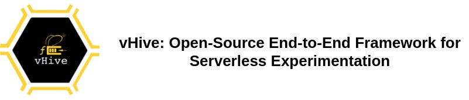
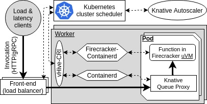

[](https://github.com/vhive-serverless/vhive/actions)
[](https://github.com/vhive-serverless/vHive/actions/workflows/firecracker_cri_tests.yml)
[](https://github.com/vhive-serverless/vHive/actions/workflows/gvisor_cri_tests.yml)
[](https://goreportcard.com/report/github.com/vhive-serverless/vhive)
[](https://opensource.org/licenses/MIT)
<a href="https://twitter.com/intent/follow?screen_name=ease_lab" target="_blank">
</a>



## News

A full-day tutorial, co-located with the ASPLOS'22 conference, is going to take place in Lausanne, Switzerland on March 1. The tutorial will be in a hybrid format (both in-person and virtual) and will cover both the serverless cloud foundations and the vHive ecosystem and include several hands-on sessions. In this tutorial, the participants will learn how to analyze performance of commercial and open-source clouds as well as how to experiment and innovate across serverless stack using vHive. For more information, please visit the [tutorial webpage](https://ease-lab.github.io/vhive-asplos22).

## Mission

vHive aims to enable serverless systems researchers to innovate across the deep and distributed software stacks
of a modern serverless platform. Hence, we built vHive to be representative of the leading
Function-as-a-Service (FaaS) providers, integrating the same production-grade components used by the providers, including
[AWS Firecracker hypervisor](https://firecracker-microvm.github.io/),
Cloud Native Computing Foundation's [Containerd](https://containerd.io/),
and [Kubernetes](https://kubernetes.io/). 

vHive adopts the [Knative](https://knative.dev/) flexible programming model, allowing the researchers to quickly deploy
and experiment with *any* serverless applications that may comprise many functions,
running in secure Firecracker microVMs, as well as serverfull services.
Both the functions and the stateful services can be deployed using OCI/Docker images.

vHive empowers systems researchers to innovate on key serverless features,
including functions autoscaling and cold-start delay optimization with several snapshotting mechanisms.

vHive has added support for the state-of-the-art extension [eStargz](https://github.com/containerd/stargz-snapshotter) to container layers and lazy pull support for container images.

vHive supports running Knative on top of [`OpenYurt`](https://openyurt.io/), an open platform that extends upstream Kubernetes to run on edge node pools. More details on how to the `Knative-atop-OpenYurt` mode are described [here](scripts/openyurt-deployer/README.md).

## vHive architecture



The details of the vHive architecture can be found in our ASPLOS'21 paper
([extended abstract](https://asplos-conference.org/abstracts/asplos21-paper212-extended_abstract.pdf),
[full paper](docs/papers/REAP_ASPLOS21.pdf)).

Currently, vHive supports 3 types of sandboxes for functions, namely
[Firecracker MicroVMs](https://firecracker-microvm.github.io/) (default),
[gVisor MicroVMs](https://gvisor.dev/),
and Containerd containers (as in vanilla Knative).


### Technical talks

* [Slides](docs/talks/vHive_REAP_@AWS_04_02_2021.pdf) from
[Dmitrii](https://ustiugov.github.io)'s talk at AWS on Feb, 4th 2021.
* ASPLOS'21 talks on YouTube:
[short](https://www.youtube.com/watch?v=w1vGb0X0SUQ), [long](https://www.youtube.com/watch?v=zfLd_MTGOA8).
* Serverless and vHive tutorial [series](https://www.youtube.com/playlist?list=PLVdxPJaekjWqBsEUwnrYRQCaMqvcDVsBE)
* Upcoming serverless computing workshop at EuroSys 2023 [website](https://vhive-serverless.github.io/sesame-eurosys23)


## Referencing our work

If you decide to use vHive for your research and experiments, we are thrilled to support you by offering
advice for potential extensions of vHive and always open for collaboration.

Please cite our paper that has been recently accepted to ASPLOS 2021:
```
@inproceedings{ustiugov:benchmarking,
  author    = {Dmitrii Ustiugov and
               Plamen Petrov and
               Marios Kogias and
               Edouard Bugnion and
               Boris Grot},
  title     = {Benchmarking, Analysis, and Optimization of Serverless Function Snapshots},
  booktitle = {Proceedings of the 26th ACM International Conference on
               Architectural Support for Programming Languages and Operating Systems (ASPLOS'21)},
  publisher = {{ACM}},
  year      = {2021},
  doi       = {10.1145/3445814.3446714},
}
```


## Getting started with vHive

vHive can be readily deployed on premises or in cloud, with support for nested virtualization.
We provide [a quick-start guide](docs/quickstart_guide.md)
that describes how to set up an experiment with vHive.


## Developing vHive

### Developer's guide and performance analysis with vHive

We provide a basic developer's guide that we plan to extend in future.
We encourage the community to contribute their analysis scenarios and tools.

You can view the vHive documentation [here](https://pkg.go.dev/github.com/vhive-serverless/vhive).

### vHive maintenance

vHive is a community-led project maintained by the EASE lab at the University of
Edinburgh and the HySCALE lab at Nanyang Technological University.
To guarantee high code quality and reliability, we deploy fully automated CI
on cloud and self-hosted runners with GitHub Actions.

The statistics of this repository's views, clones, and forks are available by the following
[link](https://vhive-serverless.github.io/vhive.github.io/vhive-serverless/vhive/latest-report/report.html).


### Getting help and contributing

We would be happy to answer any questions in GitHub Issues and encourage the open-source community
to submit new Issues, assist in addressing existing issues and limitations, and contribute their code with Pull Requests.
Please check our guide on [Contributing to vHive](docs/contributing_to_vhive.md) if you would like contribute.
You can also talk to us in our [Slack space](https://join.slack.com/t/vhivetutorials/shared_invite/zt-1fk4v71gn-nV5oev5sc9F4fePg3_OZMQ).


## License and copyright

vHive is free. We publish the code under the terms of the MIT License that allows distribution, modification, and commercial use.
This software, however, comes without any warranty or liability.

The software is maintained at the [EASE lab](https://easelab.inf.ed.ac.uk/) at the University of Edinburgh and the
[HySCALE](https://ustiugov.github.io/) at Nanyang Technological University.


### Maintainers

* High-level architecture, roadmap: Dmitrii
  Ustiugov ([GitHub](https://github.com/ustiugov),
  [twitter](https://twitter.com/DmitriiUstiugov), [web page](https://ustiugov.github.io));
* Issues, discussions, and tests on GitHub: [Leonid Kondrashov](https://github.com/leokondrashov);
* Integration with firecracker-containerd [Georgiy Lebedev](https://github.com/curiousgeorgiy);
* Integration with Knative: [Shyam Jesalpura](https://github.com/shyamjesal)
