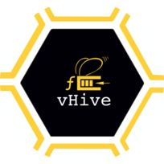

[](https://travis-ci.com/ease-lab/vhive)
[](https://goreportcard.com/report/github.com/ease-lab/vhive-orchestrator)
[](https://opensource.org/licenses/MIT)



# Usage notes

## Networking
The orchestrator creates taps and bridges with IPs when starting/loading and offloading/stopping VMs.

Note 1: CNI network configuration is supported in general (commented out for now) but it does not allow to 
keep track of the IP addresses that are given to VMs or reuse them.

Note 2: When orchestrator panics, it leaves taps and bridges that need to be cleaned manually by running `scripts/clean_fcctr.sh`


# Development notes

## Testing

The orchestrator includes both unit/module tests and end-2-end tests. Most test are automatically run on Travis.
However, a few parallel tests do not work on Travis and need to be run locally.
**Before merging any code, make sure ALL such tests pass on 
your local machine!** To run these tests:
```
make test-skip-all
```
### Running remaining tests locally
You can still run the tests which are supported on Travis on your local machine.

To run the unit tests:
```
make test-subdirs
```

To run the end-to-end tests:
```
make test-orch
```

## Developing on CloudLab
The [CloudLab Wiki page](https://github.com/ustiugov/fccd-orchestrator/wiki/CloudLab-Guidelines) describes how to set up an experiment on CloudLab.
