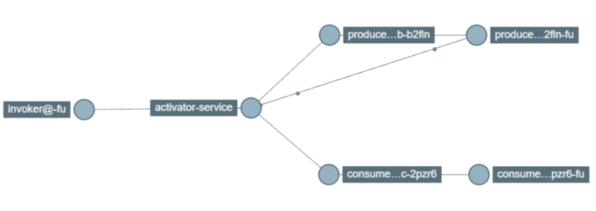
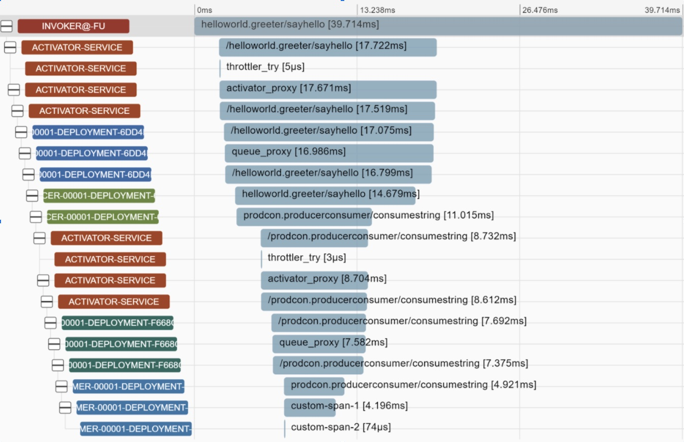

# Adding Benchmarks to vHive/Knative and Stock Knative
When creating a benchmark which is composed of multiple functions, one can choose to compose their
functions with synchronous calls (where a caller waits for the callee) or asynchronously (no
waiting). The Knative programming model can support both of these through its _Serving_ and
_Eventing_ modules, and so if one has a workload which they would like to bring up to use with
vHive or stock Knative they will need to choose between the two. Both approaches are described in
this document along with details on any extra Kubernetes (k8s) or Knative services/manifests which
are necessary for implementing such a benchmark.

Note that this is not a step-by-step guide, but rather a general rundown of the core steps that one
would need to take in implementing their workload. This overview consists of general guidelines
which will apply to all implementations as well as sections dedicated specifically to the serving
and eventing approach.

## General Guidelines
Apart from using the serving or eventing Knative component, the process of composing functions
will also need to include support for a remote procedure call system such as
[gRPC](https://grpc.io/docs/languages/go/quickstart/), and Docker. Throughout this document are
included references to examples of both serving and eventing using gRPC and Docker to implement a
composition of functions which runs with Knative on a k8s cluster, and as such guidance is given
for these systems specifically, though similar factors should apply to any alternatives.

### RPC Implementation
Remote Procedure Call support allows functions to communicate over a network. gRPC with protobuf
is used in [the serving example](/function-images/tests/chained-function-serving). Refer to the
[gRPC tutorial](https://grpc.io/docs/languages/go/basics/) for details on usage of these
systems.

First one should define a [proto file](https://developers.google.com/protocol-buffers/docs/proto3)
which describes the services used to communicate across functions. Use this to generate code with
`protoc`, making sure that the appropriate plugins for the used language are installed (e.g. our
example needs the Golang plugins as described [here](https://grpc.io/docs/languages/go/quickstart/). An
example proto file and the generated code can be found
[here](/function-images/tests/chained-function-serving/proto).

Within each function one will need to support the appropriate proto service (i.e. implement a
server or client using the generated proto code) by implementing the interface. Keep in mind that
some functions such as the
[producer in the serving example](/function-images/tests/chained-function-serving/producer/producer.go)
will need to be both a server of one proto service and a client of another proto service
simultaneously. Refer to the [gRPC tutorial](https://grpc.io/docs/languages/go/basics/) for extra
detail.

### Dockerizing Functions
To deploy functions on Knative one will need to package them as
[Docker containers](https://www.docker.com/resources/what-container). Each function which will be
deployed on a cluster will need to be a separate image.

In the provided serving and eventing examples the
[Dockerfile](/function-images/tests/chained-function-serving/Dockerfile) uses target_arg arguments to
work in tandem with the [Makefile](/function-images/tests/chained-function-serving/Makefile) to
reduce repetition, but it is also fine to write simple separate Dockerfiles for each function. One
should push the images of their functions to Docker hub to make them accessible on their cluster.

### Manifests - K8s, Knative, vHive
Manifests are used to define the deployed services. The specifics of what goes into a manifest and
how many manifests are needed depends on whether serving or eventing is used, and the details on both
are given in their appropriate sections.

Since vHive functions use gRPC, for example in both the
[serving](/function-images/tests/chained-function-serving/service-producer.yaml) and
[eventing examples](/function-images/tests/chained-function-eventing/manifests/4-ksvc.yaml), one will
need to include the `h2c` port translation in each relevant manifest.

vHive manifests must follow a specific structure, and they rely on hosting a guest image on a stub
image in order to work. See [this hello-world example](/configs/knative_workloads/helloworld.yaml)
for a typical vHive manifest. `h2c` port translation must be used, and one's function must be
specified as a guest image environment variable. The guest port variable must match the
containerPort associated with the h2c, and the core container image must be
`crccheck/hello-world:latest`. Because of these restrictions environment variables cannot be used
to interact with one's functions when using a vHive manifest, and this is also why it is advised
that relying on environment variables in general is avoided throughout the process of bringing up a
workload.

### Tracing
Tracing allows gathering timing data in a cluster. In vHive, we export tracing data to
[Zipkin](https://zipkin.io/) for visualization. To support tracing throughout functions, one should
instrument their functions with the calls to vHive's [tracing module](/utils/tracing). One can see
instrumentation in the Serving and Eventing [examples](/function-images/tests) that vHive provides.

vHive provides a [tracing module](/utils/tracing) that can be used to instrument various functions.
The module relies on [Opentelemetry](https://opentelemetry.io) that is a standard propelled by the
CNCF community. In future, vHive is going to provide tracing modules in a wide range of languages
(external contributions are welcome).

One can enable tracing by following these steps (example is for Golang):
1. Initialise the tracer:
   ```go
   shutdown, err := tracing.InitBasicTracer(*url, "my function")
   if err != nil {
      log.Warn(err)
   }
   defer shutdown()
   ```
   The url provided should point to the zipkin span collector service, e.g.
   `http://localhost:9411/api/v2/spans` if one hosts zipkin locally (e.g. as a Docker
   container). See the [zipkin quickstart](https://zipkin.io/pages/quickstart).

   The basic tracer can be used for most applications, and in cases where one wants to provide
   additional attributes or wishes to specify a different sampling rate they can use
   `InitCustomTracer`.
2. If the function is a server, make an instrumented grpc server:
   Example:
   ```go
   grpcServer := tracing.GetGRPCServerWithUnaryInterceptor()
   ```
3. If the function is a client, use the instrumented grpc dial method to connect to the server:
   ```go
   conn, err := tracing.DialGRPCWithUnaryInterceptor(addr, grpc.WithBlock(), grpc.WithInsecure())
   ```
4. To enable tracing instrumentation, set `ENABLE_TRACING` environment variable to
   `true` (missing values are by default `false`) during deployment.
    ```yaml
    apiVersion: serving.knative.dev/v1
    kind: Service
    metadata:
      name: foo
      namespace: default
    spec:
      template:
        spec:
          containers:
            - image: docker.io/vhiveease/FOO:latest
              imagePullPolicy: Always
              env:
                - name: ENABLE_TRACING
                  value: "true"
              ports:
                - name: h2c
                  containerPort: 80
    ```
    - Beware that tracing comes with an non-negligible overhead so end-to-end measurements
      should be performed with tracing off.

The producer in the vHive
[serving example](/function-images/tests/chained-function-serving/producer/producer.go)
gives an example usage of this utility for both server and client behaviour.

Below one can see screenshots from a producer-consumer trace visualized with Zipkin.




### Continuous Integration
New vHive workloads should be included in the automatic CI for regular testing, as this is helpful
both for code maintenance and in demonstrating how the workload should be deployed. The vHive
[function composition workflow](/.github/workflows/function-composition-bench.yml) can be referred
to as an example in which the demo serving and eventing workloads are ran both "locally" and on
a Knative cluster.

### Logging
When including logging within functions, please use `logrus` with the following format:
```go
import (
	ctrdlog "github.com/containerd/containerd/log"
)

log.SetFormatter(&log.TextFormatter{
	TimestampFormat: ctrdlog.RFC3339NanoFixed,
	FullTimestamp:   true,
})
```
See
[this code snippet](https://github.com/ease-lab/vhive/blob/dfa0d400e17595a5fb0009ec8ab3211b5b4b7f9f/vhive.go#L102)
for an example.

## Serving
To compose functions with serving we make use of the
[Knative Serving component](https://knative.dev/docs/serving/). Each of the functions will
effectively be a server for the functions that come before it, and a client of the functions that
come after. For example in a simple chain of functions `A -> B -> C`, B would be a client of
function C and a server for function A.

The serving function composition example can be found
[here](/function-images/tests/chained-function-serving), and additional CI implementation which shows
how this code is executed can be found
[here](https://github.com/ease-lab/vhive/blob/main/.github/workflows/function-composition-bench.yml).
This example implements a simple Client -> Producer -> Consumer function chain, whereby the client
triggers the producer function to generate a random string, and the consumer consumes said string
(by logging it to a file).

To deploy a workload with serving one will need to:
- Implement a remote procedure call system (e.g. `gRPC`)
- Dockerize the functions
- Write Knative manifests

### RPC Implementation
As mentioned in the general guidelines, functions will communicate with RPC calls. In the
[serving example](/function-images/tests/chained-function-serving) gRPC with protobuf is used to
achieve this.

In serving, each "link" in a chain of functions needs to implement a protobuf service. For
example in a chain `A -> B -> C` the A-B link will be one service and the B-C link will be a second
service. One should define a
[proto file](https://developers.google.com/protocol-buffers/docs/proto3) for these services, and
use it to generate code with `protoc`. An example can be seen
[here](/function-images/tests/chained-function-serving/proto).

One should implement the appropriate server or client service from the generated proto code in
their functions and remember that some functions such as the
[producer in the example](/function-images/tests/chained-function-serving/producer/producer.go) will
need to be both a server of one proto service and a client of another proto service simultaneously.

### Knative Manifests
One will need a Knative service definition for each of their functions. Refer to the
[Knative docs](https://knative.dev/docs/serving/getting-started-knative-app/) and see the
[example manifests](/function-images/tests/chained-function-serving/service-producer.yaml) for
support.

### Deployment
We recommend following the [vHive developers guide](/docs/developers_guide.md) to set up a
workload. When deploying functions from a Knative manifests one can make sure that they are
working with `kn service list` and `kn service describe <name>`.

If Knative is struggling to make revisions of pods (e.g. a service is labeled as
unschedulable) then one might be using the wrong ports in their function. Double-check Knative
manifests and function code. Port 80 should be used for serving by default, or the
$PORT environment variable which will be set by Knative when deploying a function.

If some pods are stuck on pending (`kubectl get pods -A`) then one might have exhausted system
resources. This can occur in situations where there are too many pods or containers running on
the system (e.g. if when working from within `kind` containers on cloudlab as recommended in the
[vHive developers guide](/docs/developers_guide.md)), or when using default github runners for
automated workflows.

## Eventing
One can also make use of the [Knative Eventing component](https://knative.dev/docs/eventing/) to
compose functions. There are two different eventing approaches in Knative, and we will use the
Broker-Trigger model as advised---see [Knative Eventing Primer](/docs/knative/eventing.md) for an
introduction to Knative Eventing.

Whilst it is possible to expose the broker directly to the outside world, it makes more sense to
have a service in front of it, for tasks like authentication, authorization, validation, and also
to abstract the particular broker implementation away.

An example of function composition using eventing can be found
[here](/function-images/tests/chained-function-eventing). This example implements a simple Client
(grpcurl) -> Producer -> Consumer function chain, whereby the client triggers the producer function
to generate an event, and the consumer consumes said event. The CI workflow for this example can be
found
[here](https://github.com/ease-lab/vhive/blob/main/.github/workflows/function-composition-bench.yml),
showing how the example can be deployed.

In general, to deploy a workload with eventing one will need to:
- Implement a **producer** server that processes incoming requests and raises corresponding events
- Implement event **consumers** that handle the events that are of interest
- Dockerize the functions
- Write Knative manifests for one's services and supporting components (e.g. Triggers, SinkBindings,
  etc.)

### Knative Manifests
Below presented Knative manifests of some components that we believe might be helpful to explain,
namely:
- SinkBinding
- Trigger

#### SinkBinding
**Example:**
```yaml
apiVersion: sources.knative.dev/v1
kind: SinkBinding
metadata:
  name: my-sinkbinding
  namespace: my-namespace-a
spec:
  subject:
    apiVersion: serving.knative.dev/v1
    kind: Service
    name: my-service
    namespace: my-namespace-b
  sink:
    ref:
      apiVersion: eventing.knative.dev/v1
      kind: Broker
      name: my-broker
      namespace: my-namespace-c
```

- A SinkBinding is a component that injects `K_SINK` and some other environment variables to
  configure services dynamically on runtime---such services can use the injected environment
  variables to address the Broker, the Channel, or even another Service (all called a _"sink"_) to
  send CloudEvents.
- A SinkBinding, the subject ("sender"), and the sink ("receiver") may exist in different
  namespaces.

#### Trigger
**Example:**
```yaml
apiVersion: eventing.knative.dev/v1
kind: Trigger
metadata:
  name: my-trigger
  namespace: my-namespace
spec:
  broker: my-broker
  filter:
    attributes:
      type: my-cloudevent-type
      source: my-cloudevent-source
      my-custom-extension: my-custom-value
  subscriber:
    ref:
      apiVersion: serving.knative.dev/v1
      kind: Service
      name: my-kservice
      namespace: my-namespace
```

- A Trigger is a link between a broker and a _subscriber_ that relays the incoming CloudEvents to
  the broker after filtering them on certain attributes, commonly `type` and `source` but possibly
  also any other
  [attribute extensions](https://github.com/cloudevents/spec/blob/master/primer.md#cloudevent-attributes).
- A Trigger must be in the same namespace with the broker it is attached to, but can relay
  CloudEvents to any
  [_addressable_](https://github.com/knative/specs/blob/main/specs/eventing/interfaces.md#addressable)
  _subscriber_ in any namespace.


### Deployment
- While deploying a SinkBinding, best wait until the _sink_ ("receiver") is ready and thus has an
  address that the SinkBinding can use.
    - Services that depend during initialization on the environment variables injected by the
      SinkBinding might fail (repeatedly) upon deployment until a relevant SinkBinding is applied;
      that is normal.
- While deploying a Trigger, best wait until both the _broker_ and the _subscriber_ ("receiver")
  are ready.
