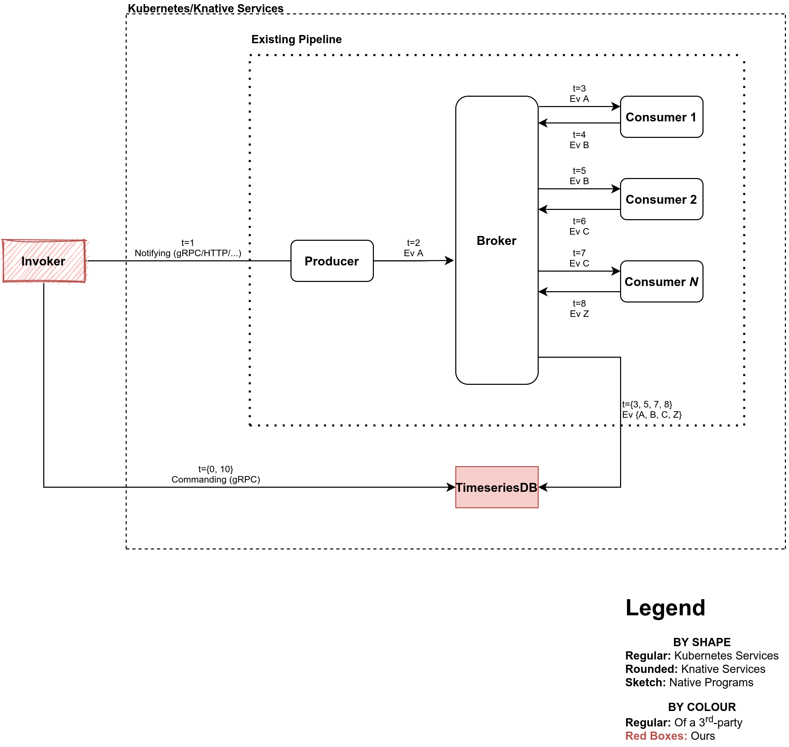

# Benchmarking Methodology
This guide aims to introduce the benchmarking methodology used in
vHive and how to run the benchmarks.

## Introduction
The key points are:
- The invoker ([examples/invoker](../../examples/invoker)) steers load to a collection of serverless apps (also called _workflows_).
- Apps can comprise a single or a collection of functions calling one another, as well as asynchronous (i.e., eventing) pipelines.
- For synchronous single- and multi-function apps, the invoker measures the latency e2e.
- For asynchronous apps, the invoker requires a workflow with a [TimeseriesDB](../../utils/benchmarking/eventing) service.
    - For each invocation, the invoker saves a timestamp of the workflow being invoked whereas TimeseriesDB waits for the corresponding completion events and takes a timestamp when the last completion event is received.
    - See [chained-function-eventing](../../function-images/tests/chained-function-eventing) for an example.
    - The invoker then retrieves from TimeseriesDB the records of all async workflows, and adds these records to the same trace as for the synchronous apps.

### TimeseriesDB

_Diagram of TimeseriesDB in a sample asynchronous pipeline_


## Benchmarking
You can use [examples/invoker](../../examples/invoker) (the "invoker") to get the end-to-end latencies of your serving and eventing workflows.

**On any node**, execute the following instructions below **at the root of vHive repository** using **bash**:
1. Build the invoker:
    ```bash
    (cd examples/invoker; go build github.com/ease-lab/vhive/examples/invoker)
    ```

    - Keep the parenthesis so not to change your working directory.
2. Create your `endpoints.json` file. It is created automatically for
    you if you use [examples/deployer](../../examples/deployer) (the
    "deployer"), however eventing workflows are not supported by the
    deployer so the following guide is presented; you may use it for
    manually deployed serving workflows too.

    `endpoints.json` is a serialization of 
    **a list of [Endpoint structs](../../examples/endpoint/endpoint.go)**
    with the following fields:

    - **`hostname` string** \
        Hostname of the starting point of a workflow/pipeline. Its
        difference from a URL is not containing a port number.

    - **`eventing` bool** \
        True if the workflow uses Knative Eventing and thus its
        duration/latency is to be measured using TimeseriesDB.
        TimeseriesDB must have been deployed and configured correctly! An example can be found in [chained-function-eventing μBenchmark](../../function-images/tests/chained-function-eventing)

    - **`matchers` map[string]string** \
         Only relevant if `eventing` is true, `matchers` is a mapping
         of CloudEvent attribute names and values that are sought in
         completion events to exist.

    **Example:**
    ```json
    [
        // This JSON object is an Endpoint:
        { 
            "hostname": "xxx.namespace.192.168.1.240.sslip.io",
            "eventing": true,
            "matchers": {
                "type": "greeting",
                "source": "consumer"
            }
        },
        ...
    ]
    ```
3. Execute the invoker:
    ```bash
    ./examples/invoker/invoker
    ```

    **Command-line Arguments:**
    - **`-rps <integer>`** \
      Targeted requests per second (RPS); default `1`.
    - **`-time <integer>`** \
      Duration of the experiment in seconds; default `5`.
    - **`-endpointsFile <path>`** \
      Path to the endpoints file; default `./endpoints.json`.

### Using docker-compose
One may include a Docker-compose manifest which helps with testing deployment locally without 
Knative. All images deployed with Docker-compose will be on the same network so they can 
communicate over a shared network, and one can use the names of services as addresses since 
they are translated automatically by Docker. Make sure to expose a port so that a client can 
communicate with the initial function in the workload. See the
[serving Docker-compose](/function-images/tests/chained-function-serving/docker-compose.yml) for an
example.
