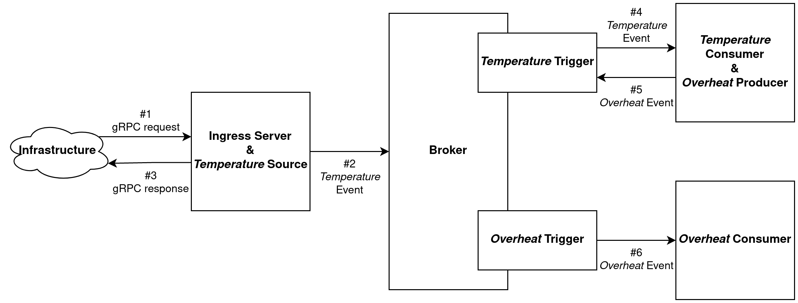
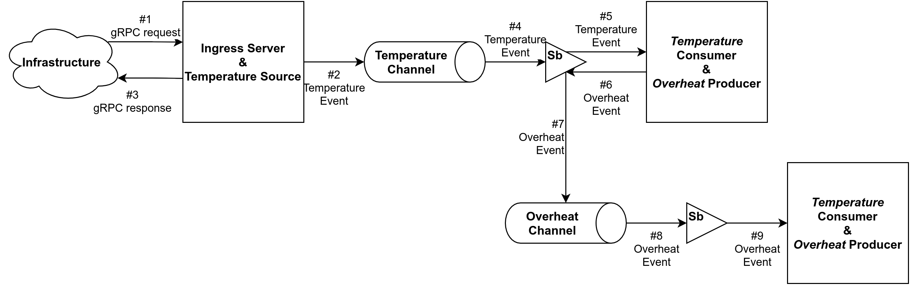
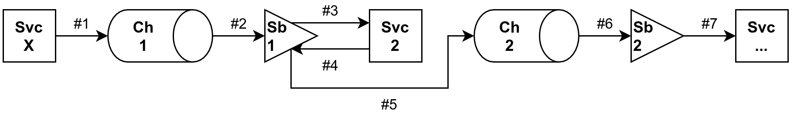
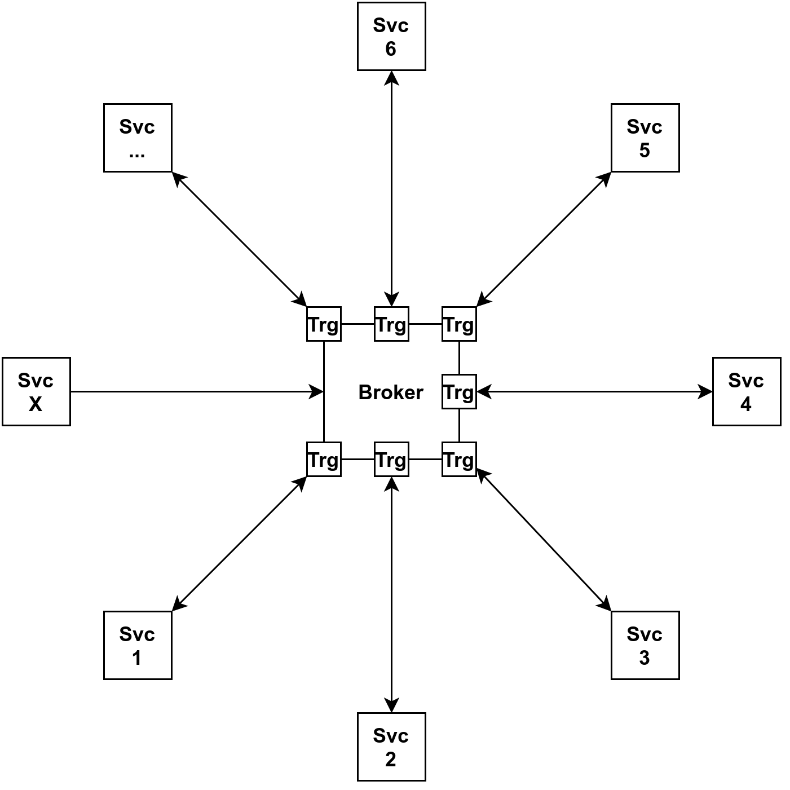

# Knative Eventing Tutorial
This document walks-through a relatively complex Knative eventing setup for introductory purposes. Go and gRPC knowledge is preferred, but not required.

## Scenario
Let's say that we would like to monitor the temperatures of nodes (i.e. dedicated servers) in our infrastructure, and alert if they overheat. Let us assume that nodes update us on their temperature by invoking a gRPC method on our monitor periodically, so events are "pushed" rather than being "pulled" by our monitor; the push model both scales better (down to zero and up to ceiling) and also is more interesting to set up. We would also like to log the temperatures for visualization and further analysis if/when needed.

## Design
Knative Eventing has three main delivery methods: (a) direct, (b) channel-subscription, and (c) broker-trigger:
- The direct method, as its name suggests, involves connecting event producers and consumers directly (i.e., without any intermediates), and such, is the simplest of all and possibly the most useless, except for some very simple cases.
- The channel-subscription model introduces _channels_ as an intermediate layer for queuing and _subscriptions_ bind subscribers to the channels while providing some delivery services too, such as retries, backing-off, and dead-letter queuing.
- Finally, the broker-trigger model is very similar to the channel-subscription model, but allows filtering of events by their metadata using _triggers_ such that a single queue (_broker_) can be used to deliver various events, in contrast to channels that forward all incoming events to all subscribers.

If we come back to our scenario, we can identify the following services:
1. An ingress server that accepts the gRPC requests from nodes in our infrastructure and generates "temperature" events.
   - We could have directly exposed our channel/broker to our nodes to push temperature data straight into, but that would (a) require the nodes to speak the protocol of our particular channel/broker (e.g. Apache Kafka), creating an accidental dependency; (b) make authentication and rate-limiting more difficult to control; and (c) not allow us to validate the incoming events (e.g. reject temperature readings if not between 0 and 100).
2. A "temperature" event consumer to (a) determine if the temperature is too high, and (b) record the temperature for visualization, further analysis, etc. If the temperature is too high, the consumer should raise an "overheat" event.
3. An "overheat" event consumer to alert the relevant teams and/or on-site engineers.

A diagram of our design looks as follows, ignoring the extra interactions such as temperature consumer logging measurements to a database and overheat consumer alerting engineers etc.:

### CloudEvents
The core concepts of CloudEvents are [summarized](https://github.com/cloudevents/spec/blob/master/primer.md#cloudevents-concepts) in the following paragraph:

> An **event** includes context and data about an **occurrence**. Each occurrence is uniquely identified by the data of the event.
>
> Events represent facts and therefore do not include a destination, whereas **\[event] messages** convey intent, transporting data from a source to a given destination.

Knative Eventing uses [CloudEvents](https://cloudevents.io/) "for describing event data in a common way." Roughly speaking, CloudEvents specify an _envelope_ of attributes (e.g. HTTP headers) that help with the processing (e.g. routing) of **events** and/or **event messages**.

The following four attributes are always required

- **`specversion`** of type String\
  Always `1.0` for the current version of the CloudEvents specification. Often automatically set and checked by the helper libraries.
- **`source`** of type [URI Reference String](https://github.com/cloudevents/spec/blob/v1.0.1/spec.md#type-system)\
  Identifies the sender of the event message. Source of an event might be different from the location of its occurrence, for example, server "lion" in us-east-1 of AWS might be on fire but if its event is generated by AWS CloudWatch, then the **source** would be `https://aws.amazon.com/cloudwatch/`.
- **`id`** of type String\
  Set by the source to uniquely identify each event from that source, meaning that `(source, id)` must be different for distinct events.
- **`type`** of String\
  Denotes "the type of event related to the originating occurrence." For namespacing, types are recommended to be prefixed with the reverse-DNS name of the organization who defines the schema of the event. For example, `com.amazon.aws.cloudwatch.temperature`.

Additional attributes of format `[a-zA-Z0-9]` can be defined with String values (or values that can be represented as strings unambiguously, [see](https://github.com/cloudevents/spec/blob/v1.0.1/spec.md#type-system)).

### Why Broker-Trigger Model?
As hinted at the beginning of this section, Triggers allow us to filter events based on their CloudEvents attributes. This allows us to use a central Broker to pool all events in, and then fan them out to respective subscribers based on their interests as indicated by the their Triggers—for example, the Trigger of Temperature Consumer would filter on condition `type=com.amazon.aws.cloudwatch.temperature` and of Overheat Consumer on `type=com.amazon.aws.cloudwatch.overheat`.

In contrast, the channel-subscription model forwards all events to all subscribers without any filtering whatsoever. Therefore, if one wants to avoid filtering in the subscriber code, one needs to build the channel pipelines manually. For example, our event-flow diagram would look like the following if we were to use channel-subscription model:

(Triangles represent the subscription objects.)

As an exercise, try drawing the case where Temperature Consumer can yield not only Overheat Events, but also _Underheat_ Events (say we do not want our servers to be cooled excessively) using Channel-Subscription model. You would have no choice but to filter events at consumers which would be undesirable.

#### Topologies of Broker-Trigger and Channel Subscription Models

Below presented the topologies of Channel-Subscription and Broker-Trigger model for generalization at an abstract level. **Svc X** represents the "ingress" service that is the starting point of the eventing pipeline.

**Channel-Subscription** model has a _line_ topology:

In contrast, **Broker-Trigger** model has a _star_ topology:

## Hands-On Tutorial
See [examples/knative-eventing-tutorial](/examples/knative-eventing-tutorial/README.md) for a step by step tutorial with all its source code available.

## See Also
- [_Knative Eventing Delivery Methods_ by Mete Atamel](https://medium.com/google-cloud/knative-eventing-delivery-methods-79d4ebe30a68)
- [_Serverless and Knative - Part 3: Knative Eventing_ by Harald Uebele](https://haralduebele.github.io/2020/06/10/serverless-and-knative-part-3-knative-eventing/)