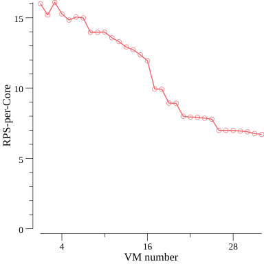

# vHive profiling tool

The tool focus on the performance characteristics of vHive framework and identify potential 
performance bottleneck of colocating VMs on a single host by [the TopDown method](https://ieeexplore.ieee.org/document/6844459). 


## Methodology

The tool is for benchmarking vHive instances by recording hardware counters, requests per second
 (RPS) and execution time for functions running inside instances.

The tool includes the following components:
- A loader function issues requests to vHive step by step until the RPS reaches the maximum. At 
  each step, the function issues a percentage of the maximum RPS (e.g., 5% of the maximum RPS) 
  and profile counters. If tail latency violates 10x image unloaded service time at a step, the 
  function stops the iteration and returns the metric before it. If the function reaches the 
  maximum RPS, it returns the metric from the maximum RPS step. 
- A single latency measurement goroutine measures the latency by injecting requests in 
  Round-Robin and measures runtimes of requests to compute the mean latency and the 
  90-percentile latency.
- The tool can bind 1 VM to a core for profiling. If profile core is set, the tool allocate only 
  one VM to the core and profiler only collects counters from the core.
- The tool can bind all VMs to a socket. If profile core is set at the same time, the profile core
  must be in the socket. Then, only one VM runs on the profile core and others run on other cores.
- A profiler invokes [toplev](https://github.com/andikleen/pmu-tools) to collect hardware counters.
  if profiling core is not set, it hides idle CPUs that are less than 50% of the busiest.
- A plotter plots line charts. The X-axis is the number of VMs and Y-axis is the value of a metric.

A load step is divided into three phases: warm-up, profiling and cool-down. The warm-up period is 
for serving the first few requests because they take a longer time for the FaaS framework to run. 
The cool-down period is because the requests are issued in Round-Robin, there are some requests 
that serve last on some VMs. So, the system runs more stably in the profiling period.

During the profile period, the loader function records the average execution time of invocations and 
how many invocations return successfully.it also invokes profiler to profile user-defined counters. 
After the iteration stops, completed RPS per core, average execution time and the average 
counters are saved in the `profile.csv`.

## Runtime Arguments
```
General:
-warmUpTime   FLOAT  The warm up time before profiling in seconds (default 5)
-profileTime  FLOAT  The profiling time in seconds (default 10)
-coolDownTime FLOAT  The cool down time after profiling in seconds (default 1)
-loadStep     INT    The percentage of target RPS the benchmark loads at every step (default 5)
-funcNames    STR    Names of the functions to benchmark, separated by comma (default helloworld)
-profileCPU   INT    Bind only one VM to the CPU and profile the physical core only (default -1)
-bindSocket   INT    Bind all VMs to socket number apart from the profile CPU (default -1)
-latSamples   INT    The number of latency measurements during one profiling period (default 100)

TestProfileSingleConfiguration:
-vm           INT    The number of VMs (default 2)
-rps          INT    The target requests per second (default 10)

TestProfileIncrementConfiguration:
-vmIncrStep   INT    The increment VM number (default 1)
-maxVMNum     INT    The maximum VM number (default 100)

Profiler:
-l            INT    Profile level (default 1)
-I            UINT   Print count deltas every N milliseconds (default 500)
-nodes        STR    Include or exclude nodes (with + to add, -|^ to remove,
                     comma separated list, wildcards allowed [+Frontend_Bound,-Backend_Bound], 
                     add * to include all children/siblings [+Frontend_Bound*], 
                     add /level to specify highest level node to match [Frontend_Bound*/2], 
                     add ^ to match related siblings and metrics [^Frontend_Bound], 
                     start with ! to only include specified nodes [!Frontend_Bound])
```

## Pre-requisites
At the root of this repository, please run the following script to install the essential tools
for profiling and binding.
```
scripts/install_pmutool.sh 
```

## Quick-start guide
### TestProfileSingleConfiguration function
`TestProfileSingleConfiguration` is for collecting counters from a fixed number of VMs and RPS 
setting during the profiling period.

Profile a single VM with `helloworld` image and 20 RPS at TopDown level 1 :
```
sudo env "PATH=$PATH" go test -v -timeout 99999s -run TestProfileSingleConfiguration \
-args -funcNames helloworld -vm 1 -rps 20 -l 1
```
Bottleneck counters are printed out with their value at each step during 
execution, such as:
```
...
INFO[] Current RPS: 1200
INFO[] Bottleneck Backend_Bound with value 75.695000
...
```
    
To study microarchitectural bottlenecks in more detail, profile the same configuration with sub-level counters. 
For example, the bottleneck is in the backend bound at level 1 and now we want to profile level 2 of the backend bound:
```
sudo env "PATH=$PATH" go test -v -timeout 99999s -run TestProfileSingleConfiguration \ 
-args -funcNames helloworld -vm 1 -rps 20 -nodes '!+Backend_Bound*/2,+MUX'
```

### TestProfileIncrementConfiguration function
`TestProfileIncrementConfiguration` increments the number of VMs by user-defined number until it 
reaches the user-defined maximum. At each step, the maximum RPS is the upper bound of RPS for 
the number of VMs at the step. For instance, there are 4 VMs with `helloworld` images. The 
unloaded service time of the image is 1 millisecond. So, the maximum RPS is around 4000. The 
request issue and profiling part of this function behave as same as `TestProfileSingleConfiguration`.

Profile from 1 VMs to 32 VMs (increment step is 1) with `helloworld` image at TopDown level 1:
```
sudo env "PATH=$PATH" go test -v -timeout 99999s -run TestProfileIncrementConfiguration \ 
-args -funcNames cnn_serving -vmIncrStep 1 -maxVMNum 32 -l 1
```
Once the profiling iteration finishes, all results are saved in the `profile.csv`. Then, the plotter retrieves 
the contents in the file and plots according to the attributes. Here is a sample image of RPS per physical core 
as the number of VMs increases from 1 to 32:


