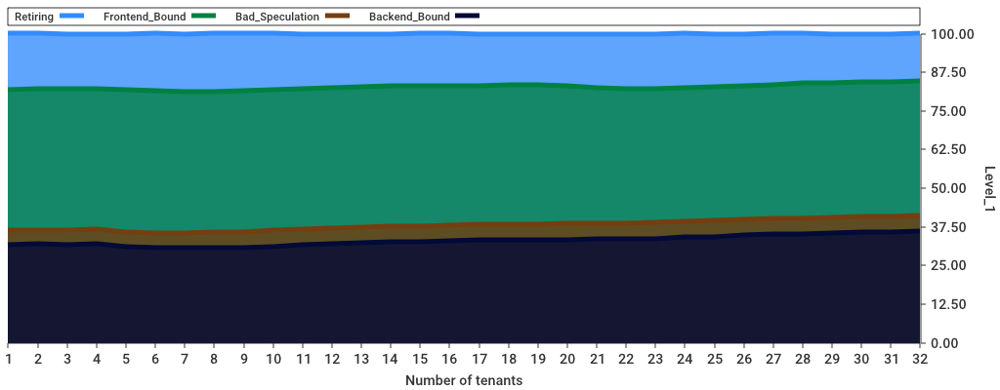
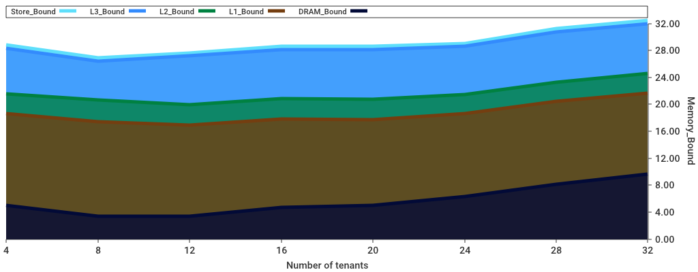

# vHive profiling tool

This tool allows its users to study the performance characteristics of serverless functions
in a highly multi-tenant environment. The tool relies on 
[the TopDown method](https://ieeexplore.ieee.org/document/6844459), to identify performance bottlenecks
that arise when colocating VMs on a single host. The tool issues requests to VMs in Round-Robin 
and collects various high-level and low-level metrics, including requests-per-second (RPS)
 per core, tail latency, hardware counters, plotting the collected metrics in a set of charts.
An example chart is shown in the [section](###TestProfileIncrementConfiguration-function).

## Methodology

The tool includes the following components:
- ***A loader function*** issues requests to functions, running in VMs, in an open loop.
The load on VMs increases step by step until the tail latency constraint, provided by the user,
is violated. The tool collects the metrics from the last step of the load that satisfies
the latency constraint.
- ***A latency measurement goroutine*** measures the latency by injecting requests
at a low rate in  Round-Robin and measures the service time of these requests to compute 
the mean latency and the tail latency (90-percentile).
- ***A profiler*** invokes [toplev](https://github.com/andikleen/pmu-tools) to collect hardware counters.
  if profiling core is not set, it hides idle CPUs that are less than 50% of the busiest.
- ***A plotter*** plots two types of charts, one is the line chart for each metric, another is 
  the stack chart for each metric group. The X-axis is the number of VMs usually and Y-axis is 
  the value of a metric. 

In ***the loader function***, a load step is divided into three phases: warm-up, profiling and cool-down. 
The warm-up period is for serving the first few requests because they take a longer time for the FaaS 
framework to run. The cool-down period is because the requests are issued in Round-Robin, there are some 
requests that serve last on some VMs. So, the system runs more stably in the profiling period.

During the profile period, the loader function records the average execution time of invocations and 
how many invocations return successfully. The Profiler and latency measurement goroutine also measure 
hardware counters and latencies at this phase. 

If tail latency violates 10x image unloaded service time at an RPS step, the function stops the iteration 
and returns the metric before it. If the function reaches the maximum RPS, it returns the metric from 
the maximum RPS step. After the iteration stops, completed RPS per CPU, average execution time and the 
average counters are saved in the `profile.csv`.

For stable and accurate measurements, there are two ways of binding VMs. If all VMs are running the same image,
only one VM needs to be measured to get rid of potential noises from the global measurement. User can set profile CPU 
ID and the tool allocates only one VM to the physical core of the CPU. Then, the profiler collects counters from the core.

While the tool is running, one may want to bind the VMs to a single socket to exclude
the interference of the processes that are running on the same CPU, e.g.,
the loader functionality. If both parameters, `-profileCPUID` and `-bindSocket`,
are defined, the former should point to a core in the same socket.

## Runtime Arguments
```
General:
-warmUpTime   FLOAT  The warm up time before profiling in seconds (default 5)
-profileTime  FLOAT  The profiling time in seconds (default 10)
-coolDownTime FLOAT  The cool down time after profiling in seconds (default 1)
-loadStep     INT    The percentage of target RPS the benchmark loads at every step (default 5)
-funcNames    STR    Names of the functions to benchmark, separated by comma (default helloworld)
-profileCPUID INT    Bind one VM to the core of the CPU and profile the core only (default -1)
-bindSocket   INT    Bind all VMs to socket number apart from the profile CPU (default -1)
-latSamples   INT    The number of latency measurements during one profiling period (default 100)
-test         BOOL   Tail latency threshold is ignored if test is true

TestProfileSingleConfiguration:
-vm           INT    The number of VMs (default 2)
-rps          INT    The target requests per second (default 10)

TestProfileIncrementConfiguration:
-vmIncrStep   INT    The increment VM number (default 1)
-maxVMNum     INT    The maximum VM number (default 100)

Profiler:
-l            INT    Profile level (default 1)
-I            UINT   Print count deltas every N milliseconds (default 500)
-nodes        STR    Include or exclude nodes (with + to add, -|^ to remove,
                     comma separated list, wildcards allowed [+Fetch_Latency,-Backend_Bound], 
                     add * to include all children/siblings [+Frontend_Bound*], 
                     add /level to specify highest level node to match [Frontend_Bound*/2], 
                     add ^ to match related siblings and metrics [+Frontend_Bound^], 
                     start with ! to only include specified nodes ['!Frontend_Bound'])
```

## Pre-requisites
At the root of this repository, please run the following script to install the essential tools
for profiling and binding.
```bash
scripts/install_pmutools.sh
```

## Quick-start guide
### TestProfileSingleConfiguration function

Before running the test, start the firecracker-containerd daemon:
```bash
sudo PATH=$PATH /usr/local/bin/firecracker-containerd --config /etc/firecracker-containerd/config.toml
```


`TestProfileSingleConfiguration` is for collecting the TopDown metrics from a fixed number of VMs and RPS 
setting during the profiling period.

Profile a single VM with `helloworld` image and 20 RPS at TopDown level 1 :
```
sudo env "PATH=$PATH" go test -v -timeout 99999s -run TestProfileSingleConfiguration -args -funcNames helloworld -vm 1 -rps 20 -l 1
```
Bottleneck counters are printed out with their values at each step during 
execution, such as:
```
...
INFO[] Current RPS: 1200
INFO[] Bottleneck Backend_Bound with value 75.695000
...
```
    
To study microarchitectural bottlenecks in more detail, one needs to profile the same
configuration at the lower level. 
For example, if the bottleneck is in the backend at level 1, one should profile level 2
of the backend category:
```
sudo env "PATH=$PATH" go test -v -timeout 99999s -run TestProfileSingleConfiguration -args -funcNames helloworld -vm 1 -rps 20 -nodes '!+Backend_Bound*/2,+MUX'
```

### TestProfileIncrementConfiguration function
`TestProfileIncrementConfiguration` increments the number of VMs by a user-defined number,
further referred to as the increment, until the number of active VMs reaches the user-defined
maximum. At each step, the maximum RPS is projected based on the independently measured
average unloaded service time of the deployed functions and the number of cores that are
available for the VMs to run on. For instance, let us assume that there are 4 VMs running
a `helloworld` function. The unloaded service time of this function is 1 millisecond, thus
the maximum RPS is 4000, assuming that there are more than 4 cores in the CPU. 
The tool would start at 5% of 4000 RPS (i.e., 200) and collect the metrics at each step,
gradually increasing the RPS until reaching the maximum RPS without violating
the tail latency constraint. Then, the tool starts more VMs, according to the increment's
value, and repeats this procedure.

Profile from 1 VMs to 32 VMs (increment step is 1) with `helloworld` image at TopDown level 1:
```
sudo env "PATH=$PATH" go test -v -timeout 99999s -run TestProfileIncrementConfiguration -args -funcNames helloworld -vmIncrStep 1 -maxVMNum 32 -l 1
```
Once the profiling iteration finishes, all results are saved in the `profile.csv`, and
the tool plots the TopDown metrics in a set of charts. Here is a sample image of
RPS per logical thread as the number of VMs increases from 1 to 32:


Because we profiled the entire TopDown level 1 metrics, a stack plot is saved for level 1:
 

Similar plots are saved if any metric at sub-level is profiled along with its siblings. For example, profiling from 4 VMs to 32 VMs (increment step is 4) with `helloworld` image at TopDown level 3 of Memory_Bound:
```
sudo env "PATH=$PATH" go test -v -timeout 99999s -run TestProfileIncrementConfiguration -args -funcNames helloworld -vmIncrStep 4 -maxVMNum 32 -nodes '!+Memory_Bound*/3,+MUX'
```
 
